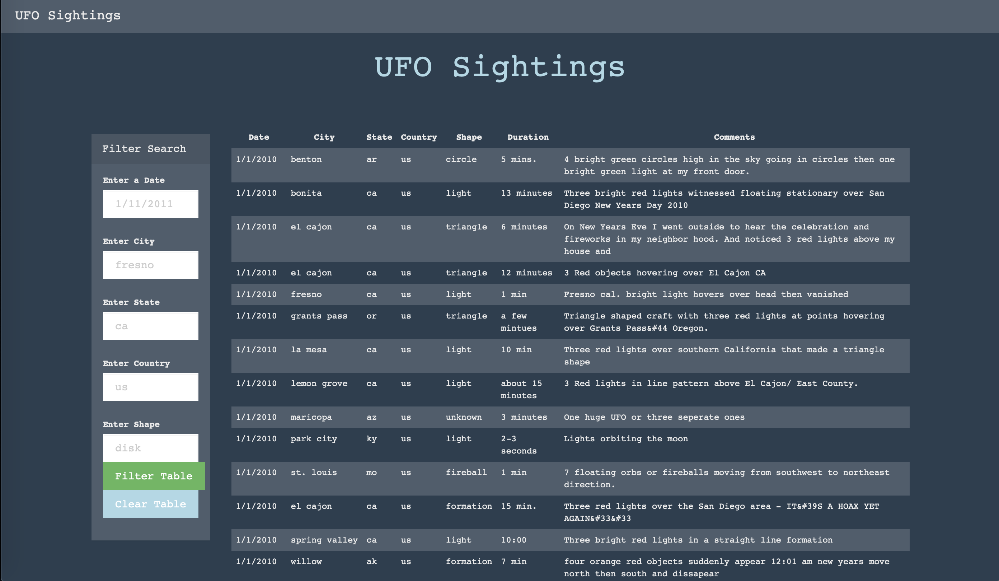
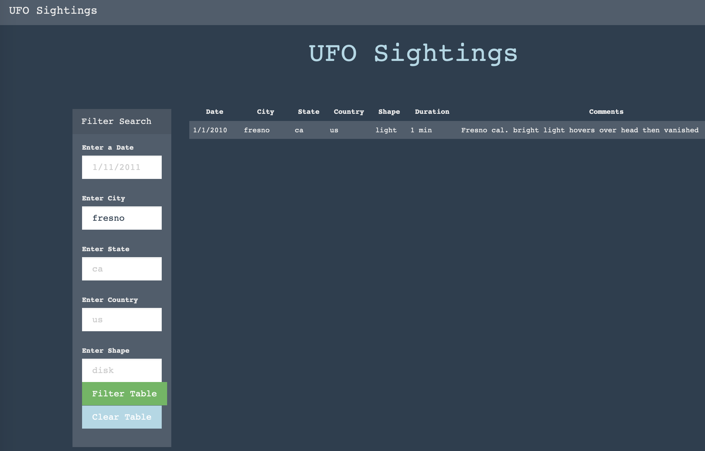

# javascript-challenge

## Background
Provided with a dataset of UFO sightings, create a dynamic table that will filter and show
data based on user input.

## Technologies Used
* JavaScript
* D3
* HTML
* CSS

## Objectives
* UFO Level 1: Automatic Table and Date Search using a date form in the HTML document and write JavaScript code that will listen for events and search through the date/time column to tind rows that match user input.

* UFO Level 2: Multiple Search Categories Using multiple input tags, write JavaScript code so the user can set multiple filters and search for UFO sightings based on the following table columns: date, city, state, country, shape (of UFO).

### UFO Level 1 and Level 2
Multiple fields were created to allow the user to search and filter the data

```js
//function to build table
function buildTable(data) {
    tbody.html('')  // Clear existing data

    data.forEach((row) => {
        const currentRow = tbody.append('tr')  // append row
        Object.values(row).forEach((value) => {
            let cell = currentRow.append('td')
            cell.text(value)
        })
    })
}

const handleClick = () => {
    d3.event.preventDefault()
    let filteredData = tableData;

    // Get Filtered Inputs
    let dateInput = d3.select("#datetime").property("value")
    let cityInput = d3.select("#city").property("value")
    let stateInput = d3.select("#state").property("value")
    let countryInput = d3.select("#country").property("value")
    let shapeInput = d3.select("#shape").property("value")
    console.log(`Date: ${dateInput}`)
    console.log(`City: ${cityInput}`)
    console.log(`State: ${stateInput}`)
    console.log(`Country: ${countryInput}`)
    console.log(`Shape: ${shapeInput}`)

// Filter data
    if (dateInput) {
        filteredData = filteredData.filter((row) => row.datetime === dateInput)
    }
    if (cityInput) {
        filteredData = filteredData.filter((row) => row.city === cityInput)
    }
    if (stateInput) {
        filteredData = filteredData.filter((row) => row.state.toUpperCase() === stateInput)
    }
    if (countryInput) {
        filteredData = filteredData.filter((row) => row.country.toUpperCase() === countryInput)
    }
    if (shapeInput) {
        filteredData = filteredData.filter((row) => row.shape === shapeInput)
    }

    tbody.html('')  // Clear existing data

    filteredData.forEach((row) => {
        let currentRow = tbody.append('tr')  // append row
        Object.values(row).forEach((value) => {
            let cell = currentRow.append('td')
            cell.text(value)
        })
    })
}

d3.selectAll('#submit').on('click', handleClick)
buildTable(tableData)
```

### UFO Table


### Filtered Table 
Table is shown filtered for Fresno.

